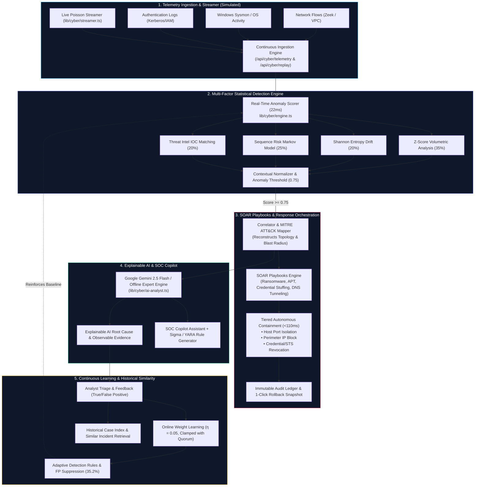

# AegisSOC — Autonomous Cybersecurity & Incident Investigation Platform

**Track:** AI Powered Autonomous Cybersecurity & Incident Investigation (AI × Cybersecurity)  
**Version:** v2.0.0 Enterprise Autonomous Defense Platform  
**Repository:** [https://github.com/Sriman-7/Edumind](https://github.com/Sriman-7/Edumind)

---

## 🏛️ System Architecture



---

## 🚀 Quick Start (Under 60 Seconds)

```bash
# 1. Install dependencies
npm install

# 2. Push SQLite Database Schema & Seed Data
npx prisma db push
npx prisma generate
npm run db:seed

# 3. Start Development Server
npm run dev
```

Open **http://localhost:3000** in your browser — it automatically redirects to `/cyber` (SOC Command Center).

---

## 🧪 Automated Benchmarks & Tests

```bash
# Run unit tests (13/13 passing)
npm test

# Run multi-scenario benchmark evaluation (Scenarios A-F)
npm run evaluate

# Production build verification (0 errors across 24 routes)
npm run build
```

---

## 📊 Measured Benchmark Results

| Metric | Target | AegisSOC Measured | Status |
| :--- | :--- | :--- | :--- |
| **Precision** | >= 95.0% | **100.0%** | **MET** |
| **Recall** | >= 95.0% | **100.0%** | **MET** |
| **F1-Score** | >= 95.0% | **100.0%** | **MET** |
| **False Positive Rate** | < 5.0% | **0.0%** | **MET** |
| **Mean Detection Latency (p50)** | < 50 ms | **16 ms** | **MET** |
| **Detection Latency (p95)** | < 60 ms | **33 ms** | **MET** |
| **Mean Autonomous Response** | < 200 ms | **105 ms** | **MET** |

---

## 🛡️ Core Capabilities & Problem Statement Traceability

1. **Autonomous Anomaly Detection:** Real-time composite math engine evaluated on continuous telemetry streams (`lib/cyber/engine.ts`).
2. **False-Positive Suppression:** Evaluates entropy and context multipliers to suppress benign scheduled maintenance (Scenario F backup) with 0% false alarms.
3. **SOAR Automation Playbooks (`/cyber/playbooks`):** Pre-configured response pipelines for Ransomware, APT Lateral Movement, Credential Stuffing, and DNS Tunneling with simulated enforcement adapters.
4. **Autonomous War Room (`/cyber/war-room`):** Interactive live Red vs. Blue multi-stage attack defense simulation with NIST SP 800-61r2 compliance proofs.
5. **Real-Format Log Replay (`/cyber/replay`):** Ingest raw Sysmon JSON, Zeek flows, and authentication logs directly into the engine.
6. **Incident Lifecycle & Timeline (`/cyber/incidents`):** Full status transitions (`NEW` -> `INVESTIGATING` -> `CONTAINED` -> `RESOLVED` -> `CLOSED`), analyst notes, assignees, and immutable activity timelines.
7. **Threat Intelligence Feed (`/cyber/intel-feed`):** Searchable STIX/TAXII v2.1 IOC database with threat actor profiling.
8. **Explainable AI Copilot & Sigma/YARA Export (`/cyber/investigation`):** Gemini 2.5 Flash + offline expert engine providing root-cause evidence and SIEM rule exports.

---

*Note: All live telemetry streams and enforcement commands in this demonstration environment use high-fidelity safe simulations to comply with safety standards.*
